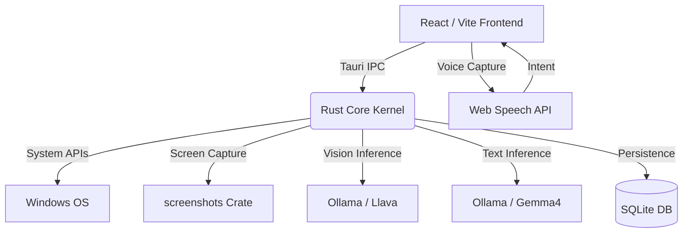

<div align="center">
  
  
  <br/>
  <br/>

  <h1>🌌 Oasis-Shell Sentient OS</h1>
  <p><strong>An autonomous, AI-driven digital workspace powered by Rust & React</strong></p>

  <p>
    <a href="https://github.com/tauri-apps/tauri"></a>
    <a href="https://reactjs.org/"></a>
    <a href="https://www.rust-lang.org/"></a>
    <a href="https://tailwindcss.com/"></a>
    <a href="https://ollama.ai/"></a>
  </p>
</div>

<hr/>

## 🔮 What is Oasis-Shell?

Oasis-Shell is not just a terminal or a dashboard—it is a **Sentient Operating System layer**. Built with a lightning-fast Rust backend (Tauri) and a beautiful React/Tailwind frontend, it acts as an autonomous digital assistant that watches your screen, manages your code, and interacts with you via natural language and voice commands.

## 🚀 Key Features

### 🧠 Photographic Memory Engine
The OS runs a silent background agent in Rust that takes a snapshot of your screen every 30 seconds. It uses a local `llava` vision model to analyze the screen, extracting context about what you're working on. 
- **Time-Machine UI:** Browse a chronological timeline of your visual history.
- **Neural Querying:** Ask *"What was I working on earlier?"* and the OS will query its SQLite memory bank to answer factually.

### 🎙️ Voice Command Engine
A fully integrated Web Speech API pipeline allows hands-free control of your OS.
- Just say **"Review code and push"**, and the system will automatically run `git status`, generate a commit message using AI, and push your code to GitHub.
- Trigger complex deployments or memory recalls without touching your keyboard.

### 🤖 Proactive AI Agents (Cron Workers)
Deploy autonomous agents with custom prompts that run on a schedule.
- E.g. *"Check if CPU usage is over 80%. If yes, warn me."*
- Agents execute silently in the background and surface alerts only when necessary.

### 🌐 3D Strategic Cortex
A visual force-directed graph (powered by `react-force-graph-3d`) that maps out your strategic objectives, context crates, and system modules in an interactive 3D space.

### 📦 Context Crates (Workspaces)
Group applications, files, and tasks into isolated "Crates". Switch contexts instantly (e.g., from *Creative Forge* to *Strategic Core*) with a single click.

---

## 🏗️ Architecture & Stack



### Tech Stack Highlights:
- **Frontend:** React, TypeScript, TailwindCSS, Framer Motion, Lucide Icons, ForceGraph3D.
- **Backend:** Rust, Tauri, rusqlite, reqwest, image processing (v0.25).
- **AI / LLMs:** Local Ollama running `llava` (Vision) and `gemma4` (Text/Agents).

---

## ⚙️ Installation & Setup

Ensure you have [Node.js](https://nodejs.org/), [Rust](https://www.rust-lang.org/tools/install), and [Ollama](https://ollama.ai/) installed.

1. **Clone the repository:**
   ```bash
   git clone https://github.com/jibin7jose/Oasis-Shell.git
   cd Oasis-Shell
   ```

2. **Install frontend dependencies:**
   ```bash
   npm install
   ```

3. **Pull required Local LLMs:**
   ```bash
   ollama pull gemma4:latest
   ollama pull llava
   ```

4. **Run the OS:**
   ```bash
   npm run dev
   ```

*(Note: The project uses a custom `.cargo/config.toml` to redirect build artifacts to `C:\dev\cargo-target` to bypass strict Windows AppLocker/Smart App Control policies.)*

---

## 📸 The Interface

The user interface features a premium glass-morphic aesthetic, designed to feel like a high-tech command center. 

- **Dark Mode Native:** Deep slate and indigo palettes.
- **Animated Substrates:** Glowing background auras that change color based on your active context.
- **Data-Dense Metrics:** Real-time RAM, CPU, and Runway metrics beautifully formatted.

<br/>

<div align="center">
  <i>"The future of computing is autonomous."</i>
</div>
