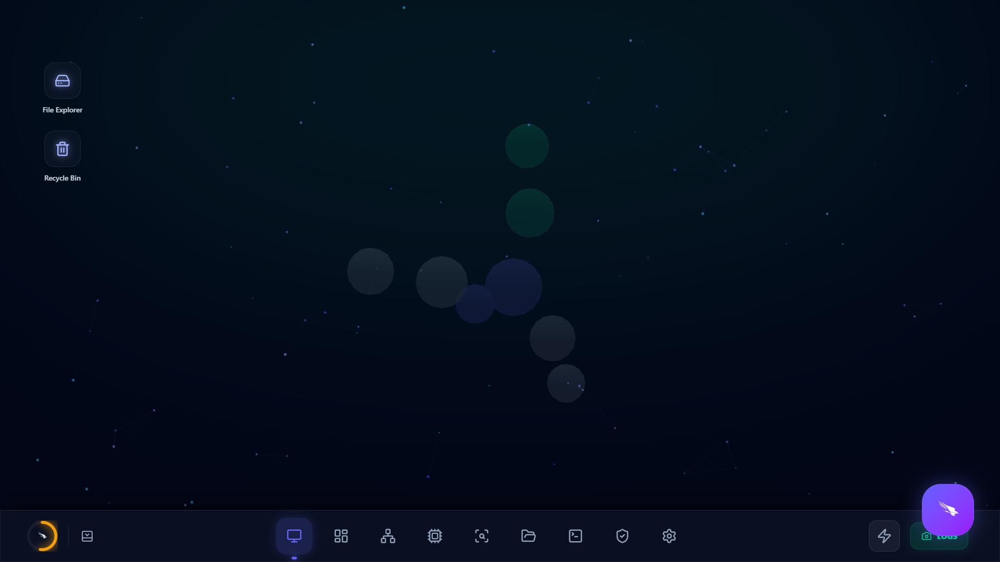

<div align="center">
  <br />
  <h1>🌌 Oasis-Shell Sentient OS</h1>
  <p>
    <strong>A next-generation, AI-driven operating system interface built with Tauri, React, and Rust.</strong>
  </p>
  <br />
  <p>
    
    
    
    
    
  </p>
  <br />
  
</div>

## 📖 Overview

Oasis-Shell is not just an application; it is a **Sentient Operating Environment**. Designed for power users, strategists, and developers, it bridges the gap between raw compute power and intuitive, AI-driven workflows. 

By leveraging the speed of Rust (via Tauri) and the fluidity of React (via Framer Motion), Oasis-Shell provides a breathtaking glassmorphic UI that reacts in real-time to system telemetry and natural language directives.

> *Note: Add a screenshot of your main dashboard here!*
> ``

---

## ✨ Premium Features

### 🧠 The Sentient Vault (Vector DB)
An intelligent file system and knowledge graph. The Vault uses local embedding models to index your documents, allowing you to search through your system using semantic meaning rather than exact keywords.
* **Glassmorphic Data Shards**: Files are represented as interactive, glowing nodes.
* **AI Synthesis**: Instant Retrieval-Augmented Generation (RAG) summaries of your files.

### 🔭 3D Strategic Cortex
A real-time, interactive 3D force-directed graph (`react-force-graph-3d`) that maps out your workspace dependencies, neural contexts, and strategic nodes. Complete with ambient nebula lighting and a live telemetry HUD.

### ⚡ Foundry Command Center (Quake Terminal)
A drop-down, global terminal that accepts natural language directives. It interprets your intent—whether you want to automate Git workflows, run a vision scan on your screen, or access system settings—and executes them seamlessly.

### ⏳ Cognitive Timeline (Action Logs)
A beautiful, chronologically ordered ledger of every action the AI has taken on your behalf. Complete with color-coded, glowing nodes for Neural events, Deployments, and System telemetry.

### 📈 Venture Simulation Portal
### 📸 Photographic Memory (Time-Machine)
An autonomous background daemon that periodically captures your active viewport, summarizes it using the LLaVA Vision Model, and commits it to a local vector store. You can query your own history natively via semantic search (e.g., "What was I working on before lunch?").

### 🛡️ Heuristic Guardian
An active telemetry supervisor that monitors CPU/RAM and disk loads. If an anomaly (like a severe memory leak) is detected, the Guardian consults the local LLM to dynamically synthesize a safe PowerShell mitigation script on the fly.

### 🎙️ Voice Intent Engine
Interact with your OS using natural language voice commands. The system records your intent, transcribes it, and routes it through a semantic intent dispatcher to execute complex macros, auto-commit Git workflows, or launch workspaces completely hands-free.

---

## 🛠️ Architecture & Tech Stack

### 🦀 Modular Rust Backend
The monolithic architecture has been fully decoupled into highly specialized, cohesive domains:
* `ai.rs` - Neural Engine, Vector Embeddings, RAG Pipeline
* `vision.rs` - LLaVA integration, Desktop Screen Capture, Photographic Memory
* `telemetry.rs` - Hardware Monitoring, Win32 Window Traversal
* `crates.rs` - Context-Aware Workspace Management & SQLite persistence
* `nexus.rs` - Executive Dashboard Metrics, System Logs, Sentience Routines
* `widget.rs` - Heads-Up Display (HUD) and Window Management

### 🎨 Frontend
* **UI/UX**: React 18, TypeScript, Tailwind CSS, Framer Motion, Lucide React
* **3D Rendering**: Three.js / React Force Graph 3D
* **State Management**: Zustand / React Context

### 🧠 Intelligence
* **Local LLM Inference**: Gemma4 / LLaVA (via Ollama)
* **Storage**: SQLite (`rusqlite`)

---

## 🚀 Getting Started

### Prerequisites
Before you begin, ensure you have the following installed:
* [Node.js](https://nodejs.org/en/) (v18+)
* [Rust](https://www.rust-lang.org/tools/install)
* [Tauri CLI](https://tauri.app/v1/guides/getting-started/setup/)

### Installation

1. **Clone the repository:**
   ```bash
   git clone https://github.com/jibin7jose/Oasis-Shell.git
   cd Oasis-Shell
   ```

2. **Install frontend dependencies:**
   ```bash
   npm install
   ```

3. **Run the development server:**
   ```bash
   npm run tauri dev
   ```

This will compile the Rust backend, bundle the React frontend, and launch the Oasis-Shell native window.

---

## 🤝 Contributing
Contributions, issues, and feature requests are welcome!
Feel free to check [issues page](https://github.com/jibin7jose/Oasis-Shell/issues). 

## 📝 License
This project is [MIT](https://choosealicense.com/licenses/mit/) licensed.
