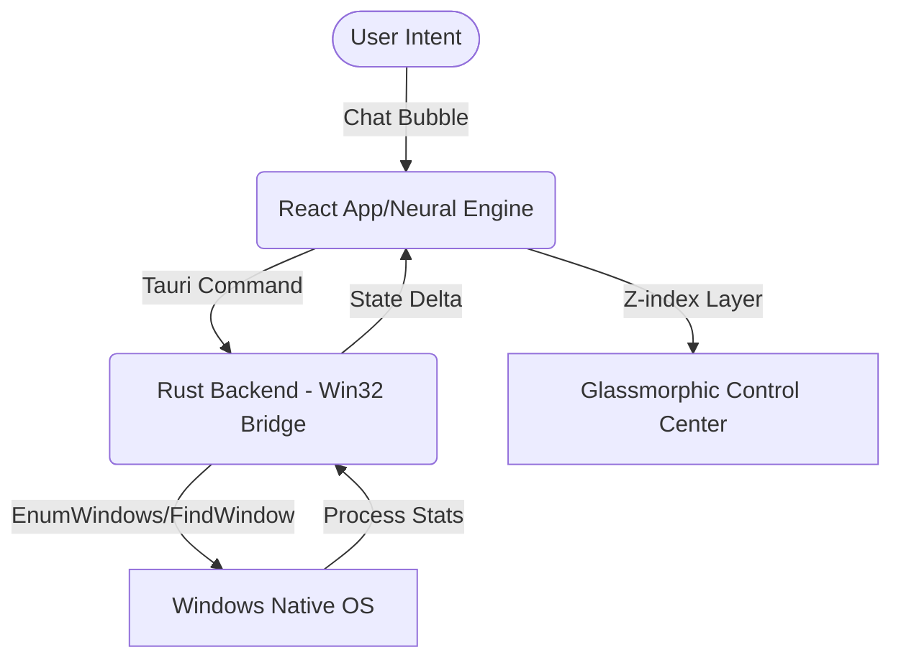

# Oasis Shell Architecture
## Neural Bridge System

This document outlines the core communication pathways for the Context-Aware OS.

### Systems Flow Diagram

## System Components
| Layer | Technology | Role |
| :--- | :--- | :--- |
| **User Overlay** | React + Framer Motion | Dynamic UI, context-switching animations |
| **Logic Bridge** | Tauri 2.0 | IPC, cross-platform security |
| **OS Core interface** | Rust + windows-rs | Low-level Win32 integration (Windows API) |
| **Styling** | Tailwind CSS v4 | Glassmorphism, premium aesthetics |

## Data Flows
- **Window Enumeration**: Rust polls the OS every 2s to track active contexts.
- **Context Crating**: User creates a "Snapshot" of open apps; Rust stores the PIDs in SQLite.
